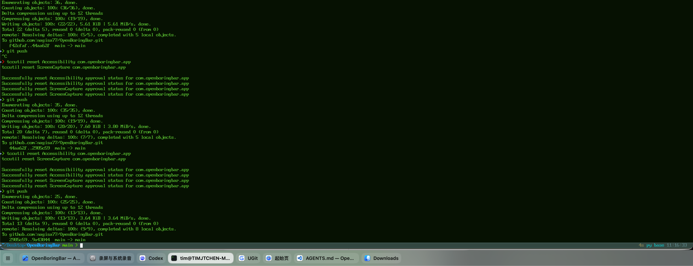
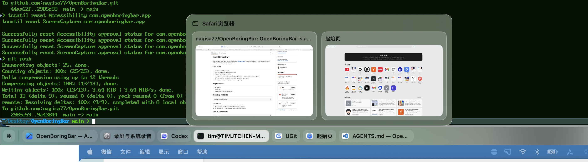
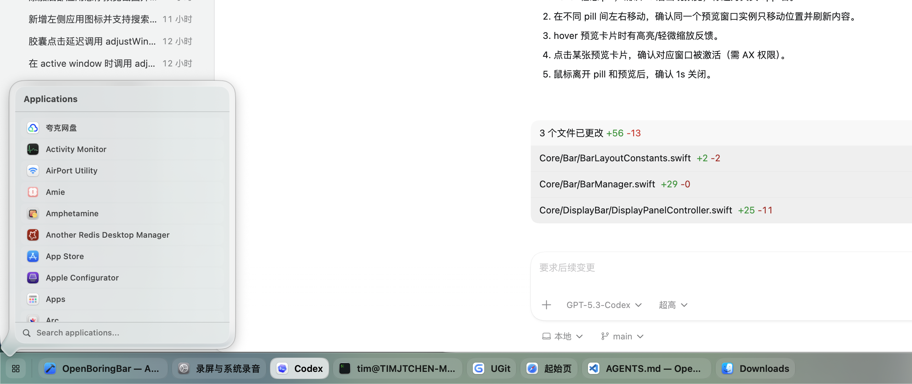

# OpenBoringBar

OpenBoringBar is an open-source alternative to [boringbar.app](https://boringbar.app), focused on delivering a practical macOS bottom taskbar experience for multi-display setups.

## Screenshots

### Normal Bar



### Multi-Window Preview



### App Launcher Search




## Core Goals

- One bottom bar per display.
- Clear running/visible app representation.
- Fast app switching from the bar.
- Hover preview panel (single reusable panel per display, supports multi-window apps).
- Left-side launcher button with searchable application open panel.
- Stability and maintainability before visual complexity.

## Requirements

- macOS 14+
- Xcode 26+
- CocoaPods (`pod` available in shell)

## Bootstrap And Build

```bash
./scripts/bootstrap.sh
```

This script runs:

1. `pod install` to regenerate project/workspace metadata.
2. `xcodebuild` for a Debug build of scheme `OpenBoringBar`.

## Manual Commands

```bash
pod install
xcodebuild -project OpenBoringBar.xcodeproj -scheme OpenBoringBar -configuration Debug -sdk macosx -destination 'platform=macOS' build
```

## License

OpenBoringBar is released under the MIT License. See [LICENSE](./LICENSE) for details.
